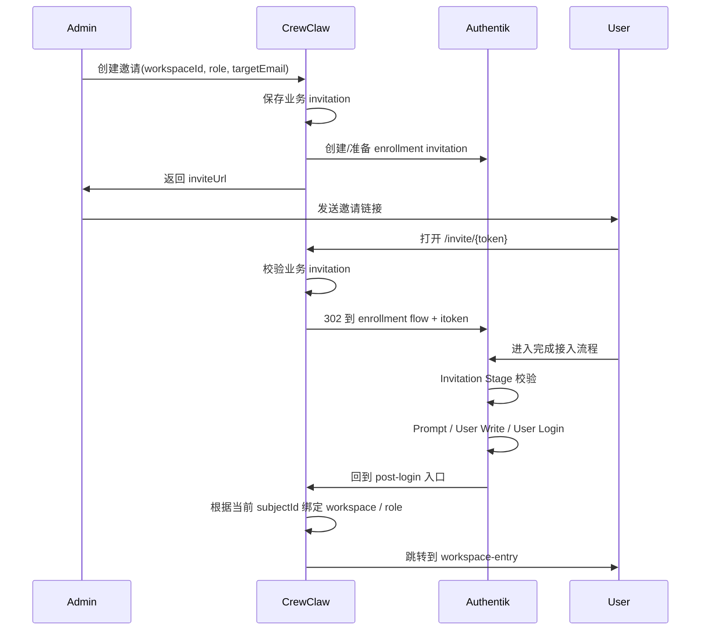

# CrewClaw 平台设计文档（Authentik 官方首版接入版）

基于既有 MVP 架构，按“**首版直接用官方 Authentik、不改源码、Docker 分容器同网络、当前仅本地账号密码、后续再接外部身份源**”重构后的统一版本。

| 文档定位 | 系统架构与 MVP 落地设计 |
| --- | --- |
| 适用范围 | 单机部署、多用户访问、容器级隔离、统一模型网关、官方 Authentik 身份接入 |
| 本版重点 | 在不修改上游源码前提下，把 Authentik 正式纳入首版交付；补齐首次管理员引导、邀请制接入、首登密码策略、Traefik + Outpost 前置鉴权 |
| 关联文档 | 《MVP 开发基线总契约》《MVP 统一总接口》《Authentik 实施文档》 |
| 当前版本 | v0.6-authentik |

---

## 0. 本次修订摘要

本版明确采用如下落地结论：

- 首版身份系统直接采用**官方 Authentik**。
- **不修改 OpenClaw / 上游源码**；只改 CrewClaw 控制面、部署层、网关层与业务绑定逻辑。
- Docker 采用**分容器、同网络**：Traefik、CrewClaw、Runtime Manager、Authentik Core、Authentik Proxy Outpost、LiteLLM、PostgreSQL 等处于同一内部网络。
- 当前只开放**本地账号密码**；Google / GitHub / 企业 SSO / 微信 / 钉钉 / 飞书全部列为后续扩展。
- workspace 子域名继续统一经 **Traefik + Authentik Proxy Outpost + Forward Auth** 做前置鉴权。
- 普通用户接入采用**邀请制**：管理员创建邀请，邀请绑定 `workspace / role`，链接携带一次性 token，用户点击后进入“完成接入”流程。
- 推荐把“首次免密码链接进入”实现为：**邀请链接本身就是一次性免密码入口**；用户在 Authentik Enrollment Flow 中完成资料和密码设置，然后自动登录。
- 密码修改机制原则上交给 **Authentik Flow** 完成；平台不自行实现一套独立密码系统。

---

## 1. 目标与范围

目标是在一台服务器上部署公司内部 CrewClaw 平台，使平台满足以下能力：

1. 官方 Authentik 统一身份接入。
2. 平台管理员可完成首版初始化与用户邀请。
3. 普通用户通过邀请链接接入系统，并绑定指定 workspace / role。
4. 用户进入平台后，继续按既有设计使用个人 runtime 工作区。
5. workspace 入口统一由 Traefik 暴露，由 Authentik 做前置鉴权。
6. 平台仍坚持“管理员提供服务、用户只使用”的团队平台模式。

MVP 仍然不追求：

- 复杂多租户隔离 UI；
- 用户自助 provider key 管理；
- 用户自助模型绑定；
- 复杂费用管理；
- 企业级目录同步首版接入；
- 微信 / 钉钉 / 飞书等第三方登录首版上线。

| 范围 | MVP 结论 |
| --- | --- |
| 身份系统 | 采用官方 Authentik |
| 首次管理员初始化 | 使用官方初始化流程；必要时补建日常 `admin` 账号 |
| 登录方式 | 仅本地账号密码 |
| 邀请机制 | 平台 invitation + Authentik enrollment flow 组合 |
| 工作区访问 | Traefik + Authentik Forward Auth |
| 用户密码 | 交给 Authentik 管理 |
| 外部身份源 | 后续扩展，不在首版启用 |

---

## 2. 先给结论：我的文档要不要改？

**要改，而且必须改。**

原因不是因为原方案错误，而是因为原文档里虽然已经把 Authentik 放进了入口层，但还没有把以下关键事实冻结成可开发的基线：

1. **首次启动管理员引导**还没有被写成明确流程。
2. **邀请制接入**还没有成为完整对象模型与时序。
3. **本地账号密码首版、外部身份源后加**这一约束还没有写成硬规则。
4. **用户密码修改与强制改密由 Authentik Flow 管理**还没有写入契约。
5. **平台 invitation token 与 Authentik invitation token 的关系**还没有明确定义。
6. **Traefik / Outpost / Forward Auth / workspace 子域名**的关系还需要从“概念接入”提升到“交付接入”。

因此本版文档不再只把 Authentik 看成“登录网关”，而是把它提升为：

- 管理员首登与初始密码设置系统；
- 本地用户目录与密码托管系统；
- invitation enrollment 执行系统；
- workspace 统一前置鉴权系统；
- 未来外部身份源汇聚入口。

---

## 3. 整体架构（修订版）

### 3.1 组件分层

- **入口层**：Traefik
- **身份层**：Authentik Server、Authentik Worker、Authentik PostgreSQL、Authentik Redis、Authentik Proxy Outpost
- **平台层**：CrewClaw 控制面 API + 极简 Web UI
- **编排层**：Runtime Orchestrator + Runtime Manager
- **运行时层**：Per-user OpenClaw runtime
- **模型层**：LiteLLM + PostgreSQL + vLLM / Ollama

| 层级 | 核心组件 | 职责 |
| --- | --- | --- |
| 入口层 | Traefik | 统一暴露平台域名与 workspace 子域名；对受保护路由挂载 Authentik Forward Auth |
| 身份层 | Authentik Core + Proxy Outpost | 本地用户、会话、密码、邀请制 enrollment、前置鉴权、未来外部身份源接入 |
| 平台层 | CrewClaw 控制面 | 用户同步、邀请绑定、workspace/role 真相、runtime 真相、后台治理 |
| 编排层 | Runtime Orchestrator + Runtime Manager | runtime 启停删、配置挂载、状态回写 |
| 运行时层 | Per-user OpenClaw runtime | 用户个人工作区与本地运行环境 |
| 模型层 | LiteLLM + PostgreSQL + vLLM/Ollama | 平台统一模型出口与用量归集 |

### 3.2 部署约束

- 所有服务使用**独立容器**部署。
- 所有容器加入同一内部 Docker 网络，例如 `crewclaw_net`。
- Authentik Core 对外只暴露平台登录所需入口。
- Authentik Proxy Outpost 只负责前置鉴权，不承接业务逻辑。
- CrewClaw 控制面保存业务真相；Authentik 保存身份真相。

---

## 4. 与官方 Authentik 的联合方式

### 4.1 为什么首版用官方 Authentik 而不是自己写一套

因为你的首版需求本质上分成两层：

1. **身份能力**：用户是谁、如何登录、密码怎么管理、邀请怎么完成、会话怎么生效。
2. **业务能力**：用户应该进哪个 workspace、拿什么 role、是不是已经被禁用、能不能打开 runtime。

Authentik 非常适合承接第一层；CrewClaw 自己承接第二层。这样职责边界清晰、开发量最小、后续扩展最顺。

### 4.2 推荐联合策略

首版采用以下组合：

- 平台控制面与 workspace 子域名统一由 Traefik 暴露。
- Traefik 通过 Authentik Proxy Provider 的 **Forward Auth** 中间件做前置鉴权。
- Authentik 当前只启用**本地用户名 / 邮箱 + 密码**登录。
- 管理员在 CrewClaw 后台创建 invitation，CrewClaw 保存业务邀请码对象。
- CrewClaw 调用 Authentik 侧准备 enrollment invitation。
- 用户点击平台 invitation 链接后，被重定向进入 Authentik enrollment flow。
- Authentik 负责创建用户、设置密码、建立登录会话。
- 登录成功后，CrewClaw 根据 invitation 记录完成 `workspace / role` 绑定。

这意味着：

- **身份创建、密码校验、会话**归 Authentik；
- **workspace / role / user status / runtime**归 CrewClaw。

---

## 5. 首次启动：管理员账号如何处理

### 5.1 现实边界

如果坚持“**不改官方源码**”，那么官方 Authentik 首次初始化默认管理员用户是 **`akadmin`**。因此：

- “第一次登录的是管理员账号，并进入后设置自己的密码”——**官方可以直接支持**；
- “这个账号的用户名必须字面叫 `admin`”——**官方首个初始化账号默认不是 `admin`**。

### 5.2 推荐首版做法

推荐把你的需求解释为“第一次登录的是**管理员角色账号**”，而不是“用户名必须写死为 `admin`”。

首版落地流程：

1. 启动 Authentik Core。
2. 管理员访问 Authentik 官方 `initial-setup` 流程。
3. 首次在浏览器中设置默认管理员账号密码。
4. 初始管理员进入后台后完成：
   - 基础品牌配置；
   - 本地认证流确认；
   - Proxy Outpost / Provider 创建；
   - CrewClaw 平台应用接入；
   - invitation enrollment flow 导入或配置。

### 5.3 如果你坚持“后续只让 admin 登录”

建议采用下面的运营策略，而不是改源码：

1. 用官方初始化管理员完成首轮设置；
2. 在 Authentik 内新建一个日常管理员 `admin`；
3. 把 `admin` 赋予平台管理权限；
4. 把初始管理员账号降级为 break-glass 应急账号，只在恢复场景使用。

**设计结论**：首版文档以“管理员角色首登”作为正式基线；如果后续一定要强制用户名为 `admin`，则通过部署后初始化脚本或人工步骤解决，不在上游源码层做变更。

---

## 6. 本地账号密码模式（首版硬规则）

首版只开本地账号密码，不启用任何外部身份源。

### 6.1 规则

- 登录页仅展示用户名 / 邮箱 + 密码。
- 不显示 Google / GitHub / 企业 SSO / 微信 / 钉钉 / 飞书按钮。
- 不配置外部 Source。
- 平台首版用户全部为 Authentik 本地用户。

### 6.2 后续如何扩展

后续接入外部身份源时，不需要推翻首版方案，只需要：

- 在 Authentik 中新增对应 Source；
- 把 Source 挂入 Identification Stage；
- 在用户同步时扩展 `auth.method` 与 `subjectId` 映射；
- 保持 CrewClaw 的业务真相不变。

---

## 7. 邀请制接入设计（核心改动）

这是本版最重要的新增能力。

### 7.1 业务目标

管理员希望做到：

1. 创建一个邀请；
2. 邀请绑定一个目标 `workspace / role`；
3. 邀请链接带一次性 token；
4. 用户点击后进入“完成接入”页；
5. 用户首次不需要提前知道密码；
6. 用户完成接入后进入平台；
7. 之后再按普通账号密码方式登录。

### 7.2 推荐实现方式

推荐使用**双层 invitation**：

#### 第 1 层：CrewClaw 业务邀请

CrewClaw 自己保存 invitation 业务真相：

- `invitationId`
- `inviteTokenHash`
- `targetEmail`
- `workspaceId`
- `role`
- `status`
- `expiresAt`
- `authentikInvitationRef`
- `consumedByUserId`

#### 第 2 层：Authentik enrollment invitation

Authentik 负责执行身份侧 enrollment：

- 校验 invitation token 是否有效；
- 把 invitation 变成一次性 enrollment 入口；
- 在 flow 中完成用户创建 / 密码设置 / 登录会话建立。

### 7.3 为什么要双层 invitation

因为：

- `workspace / role` 是**业务真相**，应该在 CrewClaw；
- 用户密码 / 用户创建 / 会话是**身份真相**，应该在 Authentik；
- 这样未来你切换 invitation UI、增加审批、增加多 workspace 分发时，不需要重写身份系统。

### 7.4 首版推荐时序

### 7.5 “首次免密码链接进入”如何解释最合理

**推荐解释**：

- 用户第一次进入系统时，不需要预先知道密码；
- 只需要打开 invitation 一次性链接；
- 该 invitation 链接就是“首登免密码入口”；
- 在 enrollment flow 中由用户自己设置密码；
- 完成后自动登录。

这个方案比“先纯 magic link 登录，再额外弹出改密”更稳、更简单、更符合官方能力边界。

---

## 8. 密码策略

### 8.1 管理原则

密码相关逻辑全部交给 Authentik Flow 与本地用户体系管理，平台不自建第二套密码表。

### 8.2 管理员密码

- 首次由官方初始化流程设置。
- 后续通过 Authentik 自身用户设置或管理员操作修改。

### 8.3 普通用户密码

首版推荐两种模式：

#### 推荐模式 A：接入时直接设置密码

在 invitation enrollment flow 中：

1. Invitation Stage
2. Prompt Stage（收集 username / name / email / password / password_repeat）
3. User Write Stage
4. User Login Stage

优点：

- 流程简单；
- 用户第一次完成接入后即可用密码正常登录；
- 不需要额外实现“首次登录后强制再改一次密码”。

#### 备选模式 B：先进入，再强制改密

如果你坚持“第一次只靠链接进入，随后必须改密”，可以：

1. invitation flow 先创建用户并自动登录；
2. 给用户写入 `reset_password=true` 属性；
3. 在默认 authentication flow 中挂接强制改密 Prompt + User Write Stage；
4. 用户下次登录时被要求重置密码。

### 8.4 首版正式基线

本版选择 **模式 A** 作为基线，因为：

- 满足“首次可通过一次性链接进入”；
- 仍然把密码机制交给 Authentik；
- 比“先登录再改密”少一轮流程和状态管理；
- 更适合你现在强调的“首版先跑通”。

---

## 9. 新增核心对象：Invitation

除了原有 `UserRuntimeBinding`，本版新增 `Invitation` 作为必须冻结的业务对象。

| 字段 | 说明 |
| --- | --- |
| invitationId | 平台内部邀请唯一标识 |
| inviteTokenHash | 平台一次性邀请码哈希 |
| targetEmail | 目标邮箱；首版建议必填 |
| workspaceId | 目标 workspace |
| role | 目标角色，例如 `admin / user / workspace_member` |
| status | `pending / consumed / revoked / expired` |
| expiresAt | 过期时间 |
| consumedAt | 消费时间 |
| consumedByUserId | 最终接入的用户 |
| authentikInvitationRef | Authentik 侧 invitation 引用 |
| lastError | 最近一次生成或消费失败原因 |

**边界原则**：

- `workspaceId / role / status` 以 CrewClaw 为准；
- `密码 / session / flow 执行` 以 Authentik 为准。

---

## 10. UserRuntimeBinding 保持不变，但登录前置条件改变

`UserRuntimeBinding` 结构继续冻结如下：

| 字段 | 说明 |
| --- | --- |
| runtimeId | 平台内部 runtime 唯一标识 |
| volumeId | 持久化卷标识 |
| imageRef | 当前 runtime 镜像 |
| desiredState | `running / stopped / deleted` |
| observedState | `creating / running / stopped / error / deleted` |
| browserUrl | 浏览器访问入口 |
| internalEndpoint | 平台内部访问地址 |
| retentionPolicy | `preserve_workspace / wipe_workspace` |
| lastError | 最近一次失败信息 |

**变化点**不在结构本身，而在访问前置条件：

- 用户只有在 Authentik 会话有效、且 CrewClaw 用户状态为 `active`、且已完成 workspace 绑定时，才能获取有效 `browserUrl` 入口。

---

## 11. 路由、前置鉴权与 workspace 子域名

### 11.1 首版选择

首版继续采用：

- Traefik 统一路由；
- Authentik Proxy Outpost；
- Forward Auth；
- workspace 子域名前置鉴权。

### 11.2 路由模型

| 路由 | 示例 | 鉴权方式 |
| --- | --- | --- |
| 平台控制面 | `https://crewclaw.example.com` | Traefik + Authentik |
| 工作区入口 | `https://u-001.crewclaw.example.com` | Traefik + Authentik Forward Auth |
| Outpost 回调路径 | `/outpost.goauthentik.io/*` | 由 Outpost 直接处理 |

### 11.3 安全模型

- `browserUrl` 不是匿名地址；
- 知道 URL 不等于可以访问；
- 所有 workspace 子域名统一经过 Authentik 前置鉴权；
- CrewClaw 仍需在业务层检查用户状态、workspace 归属和 runtime 状态。

---

## 12. 模块职责修订

| 模块 | 修订后的职责 |
| --- | --- |
| 模块 1：身份与访问接入 | 接收 Authentik 会话上下文；同步/创建 CrewClaw 用户；识别 admin / disabled；处理 post-login invitation 收口 |
| 模块 2：租户与用户资源控制 | 维护 User / Invitation / WorkspaceMembership / UserRuntimeBinding 真相；binding 首建归口 |
| 模块 3：Runtime 编排 | 不处理身份认证；只在用户身份与业务绑定合法后处理 runtime |
| 模块 4：模型接入 | 不变 |
| 模块 5：管理后台 | 新增 invitation 创建、查看、撤销；仍负责用户治理 |
| 模块 6：用户工作台 | 新增“邀请完成后首次进入”承接逻辑；仍只展示当前用户资源 |

---

## 13. 关键调用故事（修订版）

### 13.1 首次安装与管理员初始化

1. 运维启动 Authentik Core 与依赖容器。
2. 管理员打开官方初始化入口。
3. 设置首个管理员密码。
4. 登录 Authentik 后创建：
   - CrewClaw 平台应用；
   - Proxy Provider / Outpost；
   - Enrollment Flow；
   - 本地登录规则。
5. CrewClaw 控制面开始接收 Authentik 会话并同步管理员用户。

### 13.2 管理员创建邀请

1. 管理员在 CrewClaw 后台选择目标 `workspace / role` 并填写邮箱。
2. 模块 5 调模块 2 创建 `Invitation`。
3. 模块 2 生成一次性平台 token，并保存 invitation。
4. 模块 1 / 集成层生成或关联 Authentik enrollment invitation。
5. 系统返回可发送的 invite URL。

### 13.3 用户完成接入

1. 用户打开 invitation URL。
2. CrewClaw 校验平台 token，确认未过期、未撤销、未消费。
3. CrewClaw 把当前 invitation 上下文写入短期会话/cookie，并重定向到 Authentik enrollment flow。
4. Authentik 完成 invitation 校验、用户写入、密码写入与自动登录。
5. 浏览器回到 CrewClaw post-login 入口。
6. 模块 1 完成 `/internal/users/sync`。
7. 模块 2 根据 pending invitation 完成 `workspace / role` 绑定，并把 invitation 标记为 `consumed`。
8. 用户进入工作台并可启动 runtime。

### 13.4 用户再次登录

1. 用户访问平台域名。
2. Traefik 把请求交给 Authentik 前置鉴权。
3. 用户走本地用户名/邮箱 + 密码登录。
4. 模块 1 校验并同步当前用户状态。
5. 模块 6 获取工作台信息。

---

## 14. 开发与部署方式

### 14.1 部署建议

推荐拆成以下容器：

- `traefik`
- `crewclaw-web`
- `crewclaw-api`
- `runtime-manager`
- `authentik-server`
- `authentik-worker`
- `authentik-postgresql`
- `authentik-redis`
- `authentik-proxy-outpost`
- `litellm`
- `litellm-postgresql`

全部接入 `crewclaw_net`。

### 14.2 不改源码的真正含义

这里的“不改源码”指：

- 不 fork / patch Authentik；
- 不改 OpenClaw 上游源码；
- 只在你自己的平台代码中增加：
  - invitation 业务对象；
  - Authentik 回调承接；
  - 用户同步；
  - workspace/role 绑定；
  - Traefik / Outpost 部署配置。

---

## 15. 首版明确不做的事

- 不把 workspace / role 业务真相塞进 Authentik 作为唯一真相；
- 不在首版开放 Google / GitHub / 企业 SSO / 微信 / 钉钉 / 飞书；
- 不做多因素认证强制；
- 不做多 runtime / 多 workspace 自助切换；
- 不做复杂邀请审批流；
- 不做平台自研密码系统。

---

## 16. 后续路线图

### 16.1 第二阶段

- 接入 Google / GitHub 登录；
- 在 Authentik 中新增 Source，并挂入 Identification Stage；
- 扩展 `auth.method` 与 `subjectId` 兼容逻辑。

### 16.2 第三阶段

- 企业 SSO（OIDC / SAML）；
- SCIM / 目录同步；
- 更复杂的用户生命周期管理。

### 16.3 中国企业身份源阶段

- 微信登录
- 钉钉登录
- 飞书登录

此时仍不需要推翻首版架构，只是把 Authentik 从“本地身份中心”扩展成“统一身份入口”。

---

## 17. 最终设计结论

首版最稳妥的方案不是“把所有认证逻辑都写进 CrewClaw”，而是：

- **Authentik 负责身份与密码**；
- **CrewClaw 负责业务绑定与资源治理**；
- **Traefik + Outpost 负责统一前置鉴权**；
- **Invitation 用双层模型把业务 token 与身份 enrollment 解耦**；
- **首版只开本地账号密码，后续再逐步加外部身份源**。

这样既满足你的当前诉求，也不会把首版做成难以演进的临时拼装方案。

